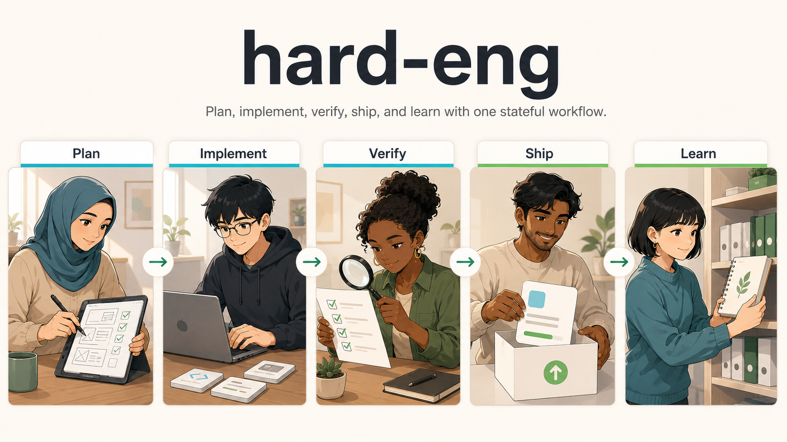
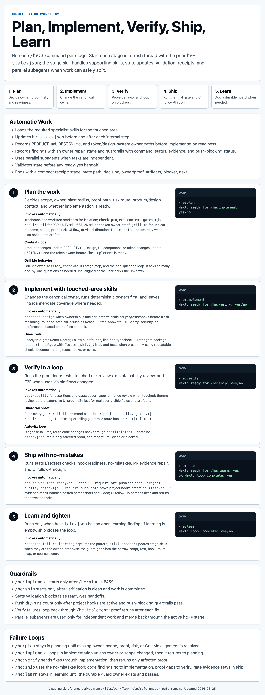

<p align="center">
  
</p>

# Hard Eng

Hard Eng is a stateful agentic engineering workflow for local coding agents. It installs one shared rule, skill, hook, and MCP surface into the agent homes on a machine, then routes real work through `/he:plan`, `/he:implement`, `/he:verify`, `/he:ship`, and `/he:learn`.

<a id="tested-scope"></a>
> Tested scope: this repo has only been tested on Codex running on macOS. Other linked runtimes are installed by the scripts, but Codex on macOS is the validated path today.

[](#he-workflow)
[](#tested-scope)
[](#shipping-and-safety)

## Install

Download the setup script first, then run one mode.

```sh
curl -fsSLO https://raw.githubusercontent.com/sgaabdu4/hard-eng/main/scripts/setup.sh
bash setup.sh --full
```

Use the lighter install when you only want the shared rules, skills, configs, and local repo hooks:

```sh
curl -fsSLO https://raw.githubusercontent.com/sgaabdu4/hard-eng/main/scripts/setup.sh
bash setup.sh --skills-only
```

Existing clone:

```sh
cd "$HOME/.agents"
./scripts/setup.sh --full
```

| Mode | Use it when | Installs |
| --- | --- | --- |
| `--full` | You want the workstation path. | prerequisites when allowed, MCP tools, skills, configs, Git hooks, watchdog, Treehouse, `no-mistakes`, optional cron, worktree readiness |
| `--skills-only` | You only want the agent surface. | repo clone/update, pinned skill submodules, linked `AGENTS.md`, linked skills/configs, local hooks |
| `--prereqs-only` | You are repairing setup dependencies. | prerequisite tools only |
| `--uninstall --yes` | You want to remove what Hard Eng installed. | managed links, skills, hooks, cron blocks, watchdog, managed bins, cache, shell PATH block |

`--skills-only` intentionally skips cron, watchdog, Treehouse, `no-mistakes`, MCP npm installs, prerequisite repair, and worktree repair.

## Uninstall

From the repo:

```sh
./scripts/uninstall.sh --yes
```

From a downloaded setup script:

```sh
bash setup.sh --uninstall --yes
```

Uninstall removes Hard Eng-managed links, skill symlinks, local hooks, cron blocks, watchdog LaunchAgent/plist, managed Codex bin files, `~/.cache/hard-eng`, and the managed shell PATH block. It does not remove shared tools such as Homebrew, Git, Node, Dart, Flutter, Treehouse, or `no-mistakes`.

## What Gets Linked

Agent instruction files are symlinks to `~/.agents/AGENTS.md`. Keep repo-specific overrides in project-level `AGENTS.md` files.

| Runtime | Linked config |
| --- | --- |
| Codex | `~/.codex/AGENTS.md`, `~/.codex/mcp-config.json`, `~/.codex/hooks.json`, `~/.codex/skills/*` |
| Claude | `~/.claude/AGENTS.md`, `~/.claude/CLAUDE.md` |
| Copilot | `~/.copilot/AGENTS.md`, `~/.copilot/skills/*` |
| Pi | `~/.pi/AGENTS.md`, `~/.pi/skills/*` |
| Pi agent | `~/.pi/agent/AGENTS.md`, `~/.pi/agent/skills/*` |

`~/.claude/CLAUDE.md` is reduced to:

```md
@AGENTS.md
```

## HE Workflow

Run one `/he:*` command per stage. Start each stage in a fresh thread with the prior `he-state.json` path; the state file is the source of truth, not the old chat transcript. The full HTML flow lives at [docs/project-workflow-gates.html](docs/project-workflow-gates.html).

<p align="center">
  
</p>

`he-state.json` tracks:

- `steps[]`: every internal step and receipt.
- `findings[]`: failures, review findings, planning concerns, and the owner repair stage.
- `guardrails[]`: deterministic scripts, tests, lints, scanners, hooks, evals, command status, evidence, and whether they block push.

Every stage ends with a compact receipt: `Stage`, `State`, `Decision`, `Owner/proof`, `Artifacts`, `Blocker`, and `Next`. `he-state.mjs validate` must pass before any ready-yes handoff.

| Stage | Command | What it does | Invokes automatically | Exit |
| --- | --- | --- | --- | --- |
| 1. Plan | `/he:plan` | Decides scope, owner, blast radius, proof path, risk route, and readiness. | Treehouse/worktree readiness; `grill-me` for unclear outcome, scope, proof, risk, UI flow, or visual direction; `to-prd` or `to-issues` only when that artifact is needed. | `Next: ready for /he:implement: yes/no` |
| 2. Implement | `/he:implement` | Changes the canonical owner and wires deterministic guardrails. | `codebase-design` when ownership is unclear; existing scripts/tests/hooks before fresh reasoning; touched-area skills. | `Next: ready for /he:verify: yes/no` |
| 3. Verify | `/he:verify` | Runs the proof loop until every required test, review, guardrail, and E2E check is clean or explicitly blocked. | `test-quality`, security/perf when touched, thermo review, E2E last, and subagents for independent proof. | `Next: ready for /he:ship: yes/no` |
| 4. Ship | `/he:ship` | Runs status/secrets checks, hook readiness, quality gates, `no-mistakes`, PR evidence repair, and CI follow-through. | `ensure-worktree-ready.sh --check --require-pre-push`, `check-project-quality-gates.mjs --require-push-gate`, `no-mistakes`. | `Next: ready for /he:learn: yes` or `Next: loop complete: yes` |
| 5. Learn | `/he:learn` | Adds a durable guard only when state has an open learning finding. | `repeated-failure-learning`; `skill-creator` only when a skill/stage contract is the owner. | `Next: loop complete: yes/no` |

Grill Me stays inside Plan. It owns `session_state.md`, its stage map, and the one-question loop. It asks as many one-by-one questions as needed until aligned or the user explicitly parks the unknown. UI uncertainty goes through Grill Me UI flow or visual design stages before implementation guesses.

Verify is the main fix loop. If any proof fails, `/he:verify` records a finding, routes code changes back through `/he:implement`, then reruns only the affected proof. `/he:ship` starts only after the verify loop is clean and work is committed.

React/Next guardrails include React Doctor, Fallow audit/dupes, lint, and typecheck. Flutter guardrails include package-root `dart analyze` with `flutter_skill_lints` and tests when present. Missing repeatable checks become scripts, tests, hooks, or evals.

## Specialist Routing

| Need | Use |
| --- | --- |
| Choose the next workflow, skill, or stage | `workflow-help` |
| Clarify ambiguous work before building | `grill-me` |
| Diagnose hard bugs, flakes, regressions | `diagnosing-bugs` |
| Decide module ownership or abstraction shape | `codebase-design` |
| Turn resolved context into a spec | `to-prd` |
| Split a plan into vertical-slice issues when slices are missing or should be published as work items | `to-issues` |
| Design or repair tests | `test-quality` |
| UI systems, tokens, or product polish | `atomic-ui` + `impeccable` |
| React app or Next.js implementation/review | `react-doctor` + `fallow`; include `fallow dupes` / clone-group checks for duplication; use `vercel-react-best-practices` for performance/composition |
| Flutter/Dart app work | `building-flutter-apps` |
| Appwrite backend work | `appwrite-backend` |
| Sentry or observability work | `sentry-workflow` |
| User-like UI regression proof | `e2e` |
| Latency or efficiency work | `performance-rescue` |
| Security, auth, secrets, or data exposure | `security-review` |
| Strict maintainability review | `thermo-nuclear-code-quality-review` |
| Direct no-mistakes validation details | `no-mistakes` |

BMAD and Compound Engineering inspiration, local rules win:

- Steal: help/front-door routing, readiness checks, next-action clarity, sharper vertical slices, and visible loop structure.
- Do not steal: personas, menu codes, generated story state, or planning ceremony that slows implementation.
- Local delivery stays stricter: code evidence, state receipts, owner-first implementation, deterministic guardrails, E2E proof, thermo review, and `no-mistakes`.

## Repo Layout

| Path | Role |
| --- | --- |
| `AGENTS.md` | Global rules: tool routing, blast-radius checks, verification gates, writing style, and skill budgets. |
| `skills/` | The active skill surface. Local skills are real folders; upstream skills are symlinks. |
| `vendor/skill-upstreams/` | Git submodules for read-only upstream skills. |
| `hooks/` | Safety hooks for command blocking, secret protection, and Codex session behavior. |
| `codex/hooks.json` | Codex hook wiring. |
| `codex/bin/` | Token-free Codex watchdog and health scripts installed under `~/.codex/bin`. |
| `mcp-config.json` | Shared MCP defaults for `context-mode` and `codebase-memory-mcp`. |
| `agents/` | Subagent role prompts. |
| `scripts/` | Install, uninstall, submodule update, cron, and compatibility helpers. |
| `tests/` | Contract checks for symlinks, hooks, env behavior, README links, workflow state, and repo policy. |

## Setup Switches

| Variable | Effect |
| --- | --- |
| `HARD_ENG_ENABLE_CRON=1` | Install the optional auto-sync cron during setup. |
| `HARD_ENG_SKIP_PREREQ_INSTALL=1` | Skip prerequisite repair. |
| `HARD_ENG_ALLOW_HOMEBREW_BOOTSTRAP=1` | Allow setup to run the upstream Homebrew bootstrap when Homebrew is missing. |
| `HARD_ENG_SKIP_FLUTTER_INSTALL=1` | Skip Flutter SDK installation. |
| `HARD_ENG_FLUTTER_HOME=/path/to/flutter` | Install or detect Flutter at a custom path. |
| `HARD_ENG_SKIP_SHELL_PATH_UPDATE=1` | Do not write the managed `~/.zshenv` PATH block. |
| `HARD_ENG_SETUP_TREEHOUSE=0` | Answer no to the setup-time Treehouse question. |
| `HARD_ENG_SKIP_TREEHOUSE=1` | Skip installing or updating Treehouse during setup. |
| `HARD_ENG_SETUP_NO_MISTAKES=0` | Answer no to the setup-time `no-mistakes` question. |
| `HARD_ENG_SKIP_NPM_INSTALL=1` | Skip MCP tool installation. |
| `HARD_ENG_SKIP_NO_MISTAKES=1` | Skip installing and initializing `no-mistakes`. |
| `HARD_ENG_SKIP_NO_MISTAKES_INIT=1` | Install `no-mistakes` but skip repo initialization. |
| `HARD_ENG_NO_MISTAKES_REPOS=/repo/a:/repo/b` | Initialize extra repos for `git push no-mistakes`. |
| `HARD_ENG_SKIP_WORKTREE_READY=1` | Skip shared worktree readiness checks during setup. |
| `HARD_ENG_WORKTREE_READY_INSTALL=1` | Allow readiness repair to run `npm ci` when a hook manager needs it. |

## Updating Skills

Initialize or repair pinned submodules:

```sh
./scripts/update-submodules.sh --init
```

Bump upstream skill pins:

```sh
./scripts/update-submodules.sh --remote
git status --short
git add .gitmodules vendor/skill-upstreams
git commit -m "Update skill submodules"
git push origin main
```

`--remote` refuses to run when tracked files or the index are dirty.

## Optional Cron Sync

Enable local auto-sync:

```sh
HARD_ENG_ENABLE_CRON=1 ./scripts/install.sh
```

Set a custom schedule:

```sh
HARD_ENG_CRON_SCHEDULE="*/30 * * * *" ./scripts/install-cron.sh
```

Cron runs `scripts/auto-sync.sh`. It updates Treehouse and `no-mistakes`, pulls `main`, bumps submodules, scans for private paths and secret-like values, commits changed pins, and pushes `main`.

## Shipping And Safety

Default shipping path: use `he-ship`, which runs [`no-mistakes`](https://github.com/kunchenguid/no-mistakes) after local verification is clean, work is committed, and a repo has been initialized with `no-mistakes init`. Before trusting a push dry-run, run `scripts/ensure-worktree-ready.sh`; it rejects private or no-mistakes-owned hook paths and repairs known portable hook managers.

Run:

```sh
git status --short --branch
git diff --check
node tests/agents-md-contract.test.mjs
node tests/codex-hooks-contract.test.mjs
node tests/git-hooks-contract.test.mjs
node tests/he-state.test.mjs
node tests/project-quality-gates.test.mjs
node tests/security-pretooluse-env.test.mjs
node tests/protect-secrets-env.test.mjs
```

Scan for local paths and secret-like values:

```sh
rg -n --hidden --glob '!.git/**' --glob '!**/.git/**' -F "$HOME" .
rg -n --hidden --glob '!.git/**' --glob '!**/.git/**' '(github_pat_[A-Za-z0-9_]+|gh[pousr]_[A-Za-z0-9_]+|sk-[A-Za-z0-9_-]{20,}|AKIA[0-9A-Z]{16}|-----BEGIN (RSA |DSA |EC |OPENSSH )?PRIVATE KEY-----)' .
```

Never commit secrets, personal paths, runtime logs, local MCP state, generated caches, private repo data, or machine-local lock state.
